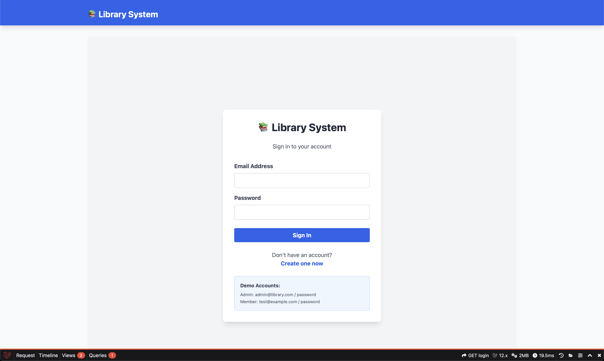
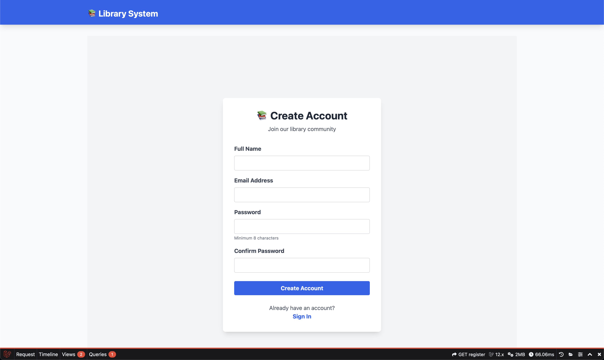
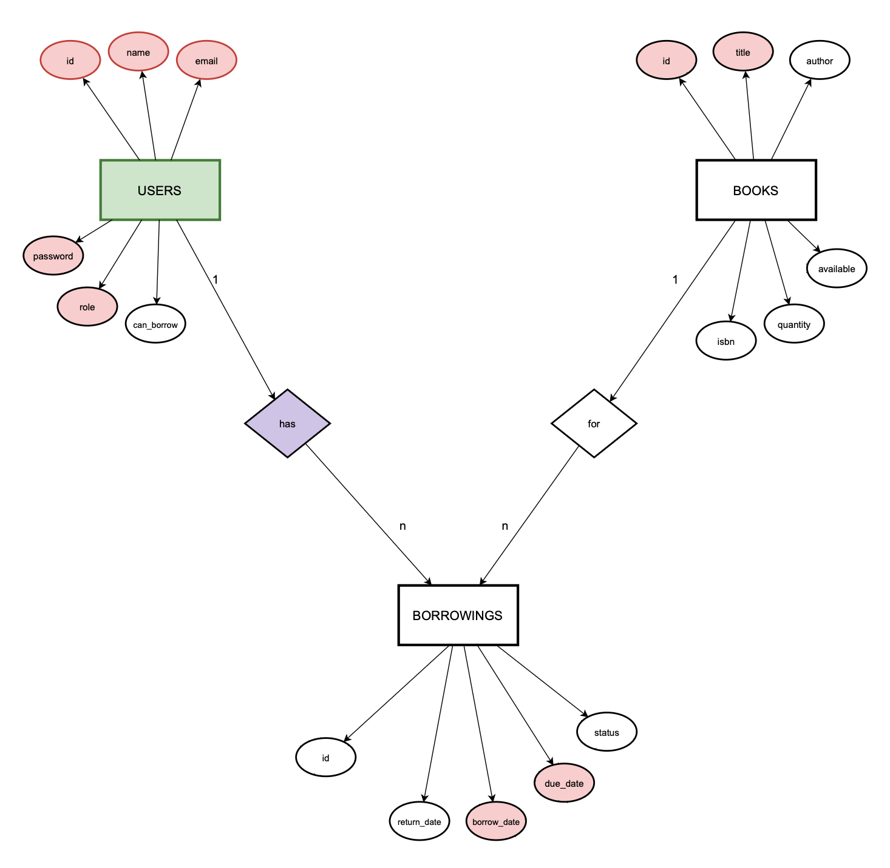

# LSP Project - Sistem Manajemen Perpustakaan

Aplikasi web untuk mengelola katalog buku, peminjaman, dan anggota perpustakaan. Sistem dibagi menjadi dua peran: Admin (petugas) dan Member (anggota). Dibangun dengan Laravel 12, MySQL, dan Tailwind CSS.

## Screenshots

Login  


Register  


Admin - Katalog Buku  


Admin - Tambah Buku  


Admin - Peminjaman Baru  


Admin - Daftar Peminjaman  


Admin - Daftar Anggota  


Member - Katalog Buku  


Member - Riwayat Peminjaman  


## Fitur

Member:
- Melihat katalog buku dan detailnya
- Melihat status ketersediaan buku
- Melihat riwayat peminjaman sendiri

Admin:
- CRUD buku dengan validasi stok
- Mencatat peminjaman dan pengembalian
- Manajemen anggota dan izin pinjam

Sistem:
- Due date otomatis (7 hari)
- Status keterlambatan (overdue/late)
- Proteksi data (hapus buku dan blok anggota dibatasi)

## Tech Stack

Frontend:
- Blade + Tailwind CSS

Backend:
- Laravel 12
- MySQL

## Quick Start

Prerequisites:
- PHP 8.2+
- Composer
- MySQL (XAMPP)
- Node.js & npm

Installation:
```bash
# 1. Masuk ke folder project
cd /Applications/XAMPP/xamppfiles/htdocs/Laravel/"LSP Project"

# 2. Install dependency PHP
composer install

# 3. Install dependency frontend
npm install

# 4. Copy env
cp .env.example .env

# 5. Generate app key
php artisan key:generate

# 6. Setup database
php artisan migrate:fresh --seed

# 7. Build asset
npm run build

# 8. Jalankan server
php artisan serve --port=3000
```

## Environment Variables

`DB_CONNECTION=mysql`  
`DB_HOST=127.0.0.1`  
`DB_PORT=3306`  
`DB_DATABASE=demo`  
`DB_USERNAME=root`  
`DB_PASSWORD=`  

## Project Structure

```
app/
  Http/Controllers/    # Controller aplikasi
  Http/Middleware/     # Middleware (role/akses)
  Models/              # Model Eloquent
  Services/            # Business logic
resources/
  views/               # Blade templates
routes/                # Web routes
database/
  migrations/          # Skema database
  seeders/             # Data awal/demo
  factories/           # Factory untuk testing/seed
public/                # Asset publik
tests/                 # Feature & unit tests
picture/               # Screenshot dokumentasi
```

## Database Schema

users:
- id (PK)
- name
- email (unique)
- password
- role (admin/member)
- can_borrow (boolean)

books:
- id (PK)
- title
- author
- isbn (unique, 13 digit)
- description
- quantity
- available

borrowings:
- id (PK)
- user_id (FK → users.id)
- book_id (FK → books.id)
- borrow_date
- due_date (borrow_date + 7 hari)
- return_date (nullable)
- status (borrowed/returned)

## OOP Implementation

Inheritance:
- Controllers mewarisi BaseController (mis. `BookController` extends `BaseController`).
- Model mewarisi Eloquent `Model` (mis. `Book` extends `Model`).

Encapsulation dan method domain:
- `Book::isAvailable()` untuk cek ketersediaan.
- `Borrowing::isOverdue()` untuk cek keterlambatan.

Service layer (business logic terpisah):
- `LibraryService` menangani operasi buku, peminjaman, dan user agar controller tetap tipis.

Contoh kode (diambil dari project):
```php
// app/Models/Book.php
class Book extends Model
{
    public function isAvailable()
    {
        return $this->available > 0;
    }
}

// app/Models/Borrowing.php
class Borrowing extends Model
{
    public function isOverdue()
    {
        return $this->status === 'borrowed' && now()->isAfter($this->due_date);
    }
}

// app/Services/LibraryService.php
class LibraryService
{
    public function recordBorrowing(User $user, Book $book): Borrowing
    {
        if (!$user->can_borrow) {
            throw new \Exception('User is not authorized to borrow books');
        }

        if ($book->available <= 0) {
            throw new \Exception('Book is not available');
        }

        $borrowing = Borrowing::create([
            'user_id' => $user->id,
            'book_id' => $book->id,
            'borrow_date' => now()->toDateString(),
            'due_date' => now()->addDays(7)->toDateString(),
            'status' => 'borrowed',
        ]);

        $book->decrement('available');
        return $borrowing;
    }
}
```

## Testing

Total test cases: 20  
Passed: 20  
Success rate: 100%

Test categories:
- Authentication (7 tests)
- Book catalog (3 tests)
- Book management (5 tests)
- Borrowing management (5 tests)
- Member management (0 tests)

Sample test case:
Lihat detailnya di `testing.md`.

## ERD

Lihat diagram di `ERD-LSP.drawio.xml`.



## Notes

- Admin tidak bisa menghapus buku yang masih dipinjam.
- Admin tidak bisa blok member yang masih punya pinjaman aktif.
- Available otomatis berkurang saat pinjam, bertambah saat kembali.
